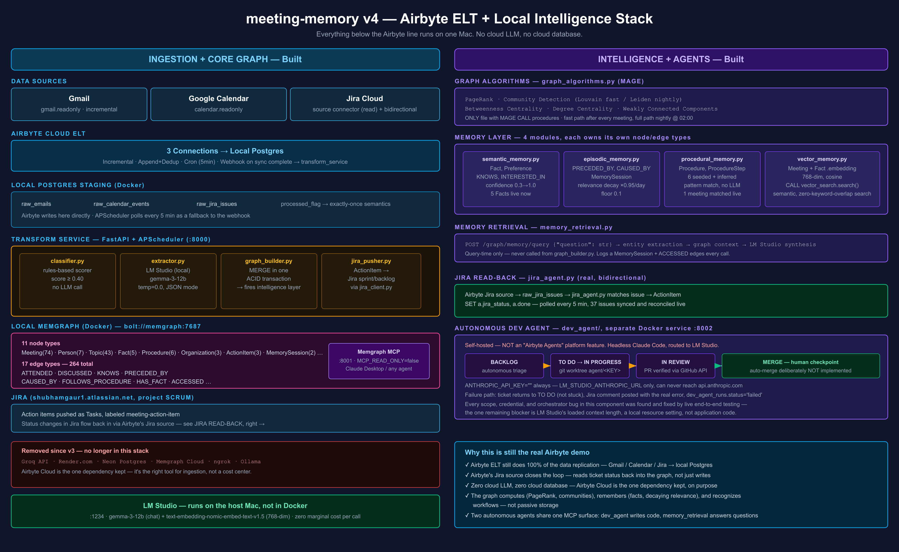

# airbyte-lm-studio-memgraph

> Meeting memory pipeline — v4. Fully local. LM Studio + Memgraph + Airbyte.

## What This Is

A local-first meeting intelligence system. Ingests Gmail, Google Calendar, and Jira via
Airbyte Cloud, extracts structured data with a local LLM (LM Studio), stores everything as
a property graph in local Memgraph — and then goes further than passive storage: the graph
computes influence (PageRank, centrality), remembers durable facts, decays stale context,
recognizes recurring meeting workflows, answers natural-language questions, and semantically
searches its own history via vector embeddings.

Two autonomous agents close the loop back into Jira: one implements engineering tickets by
running headless Claude Code against local inference, the other drafts deliverables for
non-engineering action items using Airbyte's own Agent SDK.

**Everything runs on your Mac via `docker compose up`.** No cloud LLM, no cloud database.
Airbyte Cloud is the one dependency kept — it's the right tool for ingestion, not a cost
center. See [`docs/demo_assets/Meeting_Memory_v4_Overview.pptx`](docs/demo_assets/Meeting_Memory_v4_Overview.pptx)
for the full business case + technical walkthrough, or jump straight to the
[architecture diagram](docs/demo_assets/architecture_v4.png).

## Architecture



```
Gmail / Google Calendar / Jira
         │
         ▼  Airbyte Cloud (3 connectors, incremental + Append-Dedup)
         │
         ▼  Local Postgres (Docker) ← staging, processed_flag for exactly-once
         │
         ▼  Transform Service (Docker, FastAPI + APScheduler)
              classifier.py     rules-based scorer, no LLM
              extractor.py      LM Studio → structured meeting JSON
              graph_builder.py  MERGE → Memgraph in one ACID transaction
                                 → fires graph_algorithms + memory layer + vector embed
              jira_pusher.py    ActionItems → Jira sprint/backlog
              jira_agent.py     Jira status → reads back into the graph (bidirectional)
              action_agent.py   Airbyte Agent SDK: drafts + resolves non-engineering tickets
         │
         ▼  Local Memgraph (Docker, MAGE + vector index)
              graph_algorithms.py    PageRank, community detection, centrality, WCC
              semantic_memory.py     Facts, Preferences, KNOWS, INTERESTED_IN
              episodic_memory.py     PRECEDED_BY, CAUSED_BY, relevance decay, MemorySession
              procedural_memory.py   Recurring workflows, seeded + auto-discovered
              vector_memory.py       768-dim embeddings, semantic search
              memory_retrieval.py    Natural-language Q&A over the whole graph
              + Memgraph MCP Server → Claude Desktop / any MCP-aware agent
         │
         ▼  FastAPI query layer (20 endpoints — insights, search, memory, procedures, timeline)

dev_agent/ (separate Docker service, :8002)
  Polls Jira directly → triages BACKLOG → TO DO → git worktree → headless Claude Code
  (routed to LM Studio, never api.anthropic.com) → verifies PR via GitHub API → IN REVIEW
  Human merges. Auto-merge deliberately not implemented.
```

## Quick Start

```bash
# 1. Clone and setup
git clone https://github.com/shubham-gaur-x/airbyte-lm-studio-memgraph
cd airbyte-lm-studio-memgraph
cp .env.example .env  # fill in secrets yourself — never commit .env

# 2. Start LM Studio on your Mac, load a chat model and an embedding model
#    (see .env.example for the exact model names this project expects)

# 3. Start all services
make up

# 4. Seed schema (constraints, indexes, vector index, seeded procedures)
make setup-memgraph

# 5. Run smoke test
make smoke-test

# 6. Open Memgraph Lab
open http://localhost:3000
```

## Stack

| Component | Tool | Notes |
|---|---|---|
| Ingestion | Airbyte Cloud | Gmail, Calendar, Jira connectors — incremental, Append+Dedup |
| Staging | Local Postgres (Docker) | `raw_emails`, `raw_calendar_events`, `raw_jira_issues` |
| LLM (chat) | LM Studio | Local, OpenAI-compatible API, JSON mode, temperature 0.0 |
| LLM (embeddings) | LM Studio | `text-embedding-nomic-embed-text-v1.5`, 768-dim |
| Graph DB | Local Memgraph + MAGE (Docker) | ACID transactions, vector index, graph algorithms |
| Graph MCP | Memgraph MCP Server | Claude Desktop + agent read/write |
| Graph UI | Memgraph Lab (Docker) | Cypher console + visual graph exploration |
| Ticketing | Jira | ActionItems → sprint/backlog, bidirectional status sync |
| Agent SDK | Airbyte Agents (`airbyte-agent-sdk`) | Tool layer for the action agent — BYO LLM, still LM Studio |
| Coding agent | Headless Claude Code (`dev_agent`) | Routed to LM Studio's Anthropic-compatible endpoint |
| API | FastAPI | 20 endpoints — see below |
| Tunnel | ngrok / bore | Exposes local Postgres to Airbyte Cloud for the ELT sync |

## Graph Intelligence Layer

Beyond the core Meeting/Person/Topic/Decision/ActionItem/Organization graph:

- **Algorithms** (`graph_algorithms.py`, the only file with MAGE `CALL` procedures) — PageRank,
  community detection (Louvain fast-path, Leiden nightly), betweenness/degree centrality,
  weakly connected components. Fast path fires after every processed meeting; full path runs
  nightly at 02:00.
- **Semantic memory** — durable `Fact`/`Preference` nodes with a confidence score that rises
  as more meetings confirm them; `KNOWS`/`INTERESTED_IN` relationship weights.
- **Episodic memory** — `PRECEDED_BY` temporal chains between meetings, `CAUSED_BY` causal
  links, `relevance_weight` that decays 5%/day (floor 0.1), and a `MemorySession` audit log
  of every natural-language query and which graph nodes it touched.
- **Procedural memory** — six seeded workflow templates (sprint planning, client review,
  one-on-one, incident response, project kickoff, retrospective) matched by pattern, plus
  nightly auto-discovery of new recurring patterns from unmatched meetings.
- **Vector search** — `Meeting`/`Fact` embeddings via LM Studio, MAGE `vector_search.*`,
  cosine similarity. Finds semantically related content with zero keyword overlap.
- **Memory retrieval** — `POST /graph/memory/query` answers natural-language questions by
  extracting entities, assembling graph context, and synthesizing with LM Studio.

Full design rationale: [`docs/superpowers/specs/2026-06-30-graph-memory-algorithms-design.md`](docs/superpowers/specs/2026-06-30-graph-memory-algorithms-design.md),
usage guide: [`docs/GRAPH_MEMORY.md`](docs/GRAPH_MEMORY.md).

## Autonomous Agents

**`dev_agent/`** — a separate Docker service that implements engineering Jira tickets.
`BACKLOG` (autonomous triage) → `TO DO` → `IN PROGRESS` (git worktree, headless Claude Code
against LM Studio) → `IN REVIEW` (PR independently verified via the GitHub API, never trusting
the agent's own claim). Failure returns the ticket to `TO DO` with a comment explaining why —
never stuck silently. Human merge is the one remaining checkpoint; auto-merge is deliberately
not implemented. Details: [`docs/DEV_AGENT.md`](docs/DEV_AGENT.md).

**`action_agent.py`** — runs inside `transform_service`, works the non-engineering tickets
`dev_agent` skips (labeled `meeting-action-item`). Uses the real Airbyte Agents SDK
(`airbyte-agent-sdk`, app.airbyte.ai) as a tool layer — LM Studio still does all the
reasoning. Finds eligible `To Do` tickets, pulls real graph context via `memory_retrieval`,
drafts the deliverable, posts it as a marker-prefixed comment, and moves the ticket to
`In Review`. Idempotent — a marker-comment guard means a retry never double-drafts.
Design rationale: [`docs/superpowers/specs/2026-07-02-airbyte-agents-action-agent-design.md`](docs/superpowers/specs/2026-07-02-airbyte-agents-action-agent-design.md).

Both agents share the same philosophy: autonomous up to a human checkpoint, never past it.

## API Endpoints

```
GET  /health                                    3-service status check
POST /webhook/airbyte                           Airbyte sync-complete trigger

GET  /graph/meetings/recent                     GET  /graph/person/{email}
GET  /graph/topic/{name}                        GET  /graph/actions/open
GET  /graph/timeline?window=day|week|month      GET  /graph/digest/weekly

GET  /graph/insights/influential?label=&limit=  PageRank leaderboard
GET  /graph/insights/communities                Detected clusters
GET  /graph/insights/bridges?limit=             Betweenness centrality leaderboard
GET  /graph/insights/node/{node_id}             All algorithm scores for one node

GET  /graph/procedures                          All workflow templates + occurrence counts
GET  /graph/procedures/{name}                   Steps + meetings that followed it

GET  /graph/search/meetings?q=&limit=           Semantic (vector) search over meetings
GET  /graph/search/facts?q=&limit=              Semantic (vector) search over facts

POST /graph/memory/query   {"question": str}    Natural-language Q&A over the graph
GET  /graph/memory/person/{email}               Full memory profile for one person
GET  /graph/memory/sessions                     Recent memory-query audit log

POST /agent/actions/run                         Manually trigger the action agent
```

## Development

```bash
make up               # start all services
make down              # stop all services
make logs              # tail transform_service logs
make shell             # shell into transform_service
make cypher            # open Memgraph console
make psql              # open Postgres console
make test              # run the full pytest suite (126 tests)
make backfill          # reprocess all unprocessed records
make reset-db          # wipe and restart all data
make setup-memgraph    # (re)create constraints/indexes/vector index/seeded procedures
make smoke-test        # inject sample data, verify the pipeline
make health            # LM Studio + Memgraph + Postgres status
make trigger           # fire the ingestion webhook manually
make action-agent-run  # trigger the action agent manually
make dev-agent-logs    # tail dev_agent logs
make dev-agent-trigger # manually run dev_agent against one ticket
make dev-agent-triage  # manually run BACKLOG → TO DO triage
make dev-agent-runs    # list dev_agent run history
```

126 tests, all mocked (Memgraph driver, LM Studio client, Jira/Airbyte SDK) — no live
services required to run the suite.

## Configuration

Copy `.env.example` to `.env` and fill in values yourself — never commit `.env`, and never
paste credentials into a chat/AI assistant. Key sections: LM Studio (chat + embedding model
names), Postgres, Memgraph, Jira, Airbyte Cloud ELT, Airbyte Agents SDK (a *different*
product from Airbyte Cloud — see the comment in `.env.example`), and Dev Agent (GitHub token,
scoped to this one repo).

## What's New vs v3

- LM Studio replaces Groq — local inference, no data leaves the Mac
- Local Memgraph (+ MAGE) replaces Memgraph Cloud
- Local Postgres replaces Neon
- Memgraph MCP server for natural-language graph queries from any MCP-aware agent
- Bidirectional Jira (write AND read back via Airbyte)
- Graph intelligence layer: algorithms, semantic/episodic/procedural memory, vector search
- Two autonomous agents: `dev_agent` (engineering tickets) and `action_agent` (everything else)
- ACID-compliant graph writes (batched transactions)

## Claude Code Setup

```
/plugin install superpowers@claude-plugins-official
/plugin marketplace add aneja5/forge-skills
/plugin install forge-skills@forge-skills
```

Then follow phases in [`prompts/PROMPTS.md`](prompts/PROMPTS.md). `CLAUDE.md` is the
authoritative source of truth for module boundaries and absolute rules — read it before
changing anything.

## Related

- v3 (cloud): `shubham-gaur-x/airbyte-meeting` — do not modify
- [`docs/DEMO_GUIDE.md`](docs/DEMO_GUIDE.md) / [`docs/DEMO_GUIDE_INTELLIGENCE.md`](docs/DEMO_GUIDE_INTELLIGENCE.md) — live demo walkthroughs
- [`docs/AIRBYTE_SETUP.md`](docs/AIRBYTE_SETUP.md) — Airbyte Cloud connector setup
